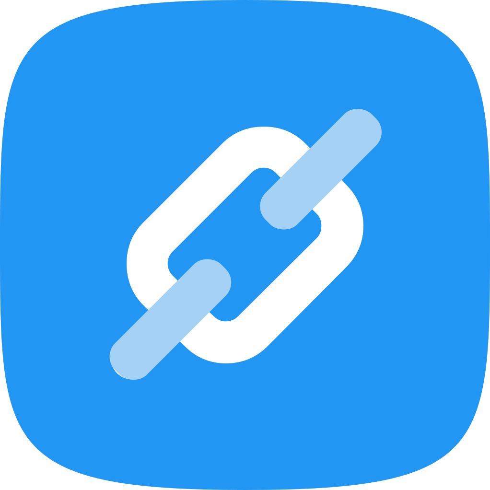
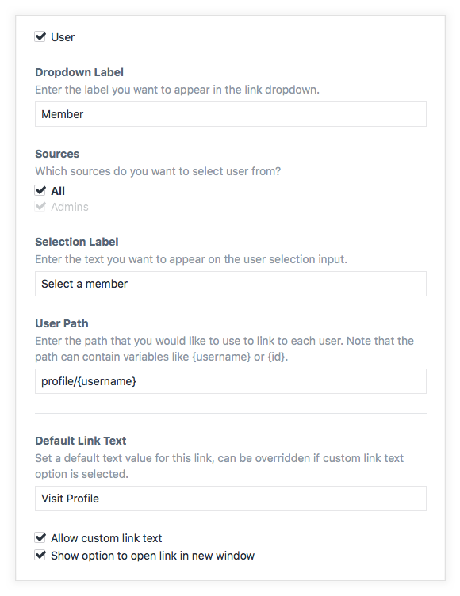
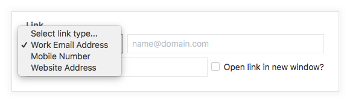
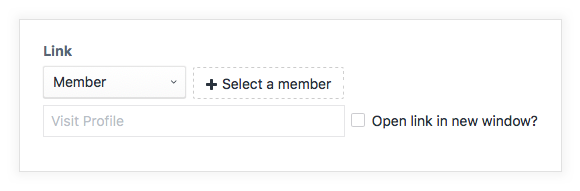

<p align="left"><a href="https://github.com/presseddigital/linkit" target="_blank"></a></p>

# Linkit plugin for Craft 4

One link field to rule them all...

This plugin adds a custom fieldtype which enables support for linking to email addresses, telephone numbers, URL's, Craft element types and more.

## New for Craft 4

*   GraphQL Support
*   Eager Loading Support

## Requirements

This plugin requires Craft CMS 4.0.0 or later.

## Installation

### Plugin Store

Log into your control panel, hit up the 'Plugin Store', search for this plugin and install.

### Composer

Open terminal, go to your Craft project folder and use composer to load this plugin. Once loaded you can install via the Craft Control Panel, go to Settings → Plugins, locate the plugin and hit “Install”.

```bash
cd /path/to/project
composer require presseddigital/linkit
```

## Configuring Linkit

Once installed, create a new field and choose the Linkit fieldtype. You'll then have the option of configuring what link type will be available to this field.

The following link types are available:

Basic

1.  Email Address
2.  Telephone Number
3.  URL

Social

4.  X (Twitter)
5.  Facebook
6.  Instagram
7.  LinkedIn
8.  YouTube
9.  WhatsApp
10. TikTok

Elements

11.  Entry
12. Category
13. User
14. Asset
15. Product

Each link type has additional option to allow further customisation. For example, the User link type allows you to set a default path...

<p align="left"></a></p>

You can also customise the dropdown labels that appear on the field.

<p align="left"></a></p>

## Using Linkit

**Template Variables (Basic Use)**

Output the custom field to get a ready built html link...

    {{ entry.linkItField | raw }}

or in full...

    {{ entry.linkItField.link }} or {{ entry.linkItField.getLink() }}

Create a customised html link...

    
    {{ entry.linkItField.link(attributes) }}

**Template Variables (Advanced Use)**

Each Linkit field returns a Linkit model with the following tags...

    {{ entry.linkItField.url }} or {{ entry.linkItField.getUrl() }}
    {{ entry.linkItField.text }} or {{ entry.linkItField.getText() }}

    {{ entry.linkItField.type }}
    {{ entry.linkItField.typeHandle }}

    {{ entry.linkItField.hasElement }}
    {{ entry.linkItField.available }} or {{ entry.linkItField.isAvailable() }}

    {{ entry.linkItField.target }}
    {{ entry.linkItField.targetString }}
    {{ entry.linkItField.linkAttributes }}
    {{ entry.linkItField.customText }}


If your link is an element link you also have access to the following...

    {{ entry.linkItField.element }} or {{ entry.linkItField.getElement() }}

or via the specific element types...

    {{ entry.linkItField.entry }} or {{ entry.linkItField.getEntry() }}
    {{ entry.linkItField.asset }} or {{ entry.linkItField.getAsset() }}
    {{ entry.linkItField.category }} or {{ entry.linkItField.getCategory() }}
    {{ entry.linkItField.user }} or {{ entry.linkItField.getUser() }}
    {{ entry.linkItField.product }} or {{ entry.linkItField.getProduct() }}

**Example Usage**

If you have created a field called 'linkItField' with a User link type like so...

<p align="left"></a></p>

    {{ entry.linkItField.link }}

would output `<a href="/profile/USERNAME">Visit Profile</a>` which is the default user path that is created in the setting and the user would be available at...

    {{ entry.linkItField.user }}

**GraphQL**

Linkit supports querying subfields with GraphQl, the following fields are available, take a look at the Craft GraphQL explorer to have a play with the return values:

    myLinkitField {
      label
      type
      typeHandle
      available
      link
      url
      text
      target
      element {
        id
        title
      }
    }

**A Note On Element Status**

To match first party element fieldtypes, Linkit now links to and allows users to select disabled elements when using element link types, we have added a new method to allow you to determine if a link is available (enabled) for the current site, as such the following will return a boolean value

    {{ entry.linkItField.avialable }} or {{ entry.linkItField.isAvialable() }}

you can use this to work out if you should display a link

    
        {{ entry.linkItField.link | raw }}
    

You can still access the linked element and any other attributes should you need to access a disabled element

    {# So long as it exists the link is always returned irrelevant of status #}
    
    
        {{ element.title }} - {{ element.url }}
    

## Custom Link Types

You can easily create your own link types,

Full documenation is coming soon, for now, take a look at the models folder. Each link type is a seperate model, just extend Link or ElementLink, depending on your needs, and everything will be set up for you.

Hook up the requirements and register custom link types in your plugin (or modules) init()...

    <?php

    ...

    use presseddigital\linkit\Linkit;
    use presseddigital\linkit\events\RegisterLinkTypesEvent;
    use presseddigital\linkit\services\LinkitService;

    use developer\plugin\models\CustomType;

    ...

    public function init()
    {
        parent::init();

        Event::on(LinkitService::class, LinkitService::EVENT_REGISTER_LINKIT_FIELD_TYPES, function (RegisterLinkTypesEvent $event) {
            $event->types[] = new CustomType();
        });

    }

If you think they are super useful and you agree we can look to add them to the core plugin for everyone to use.

Brought to you by [Pressed Digital](https://pressed.digital)
